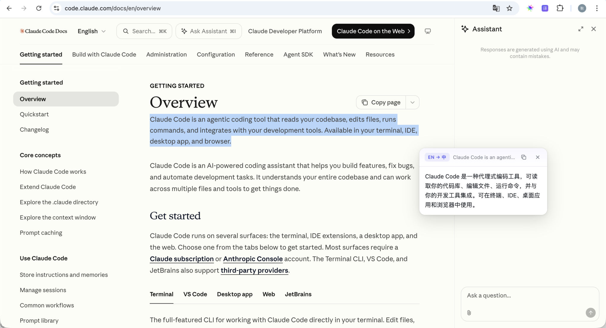
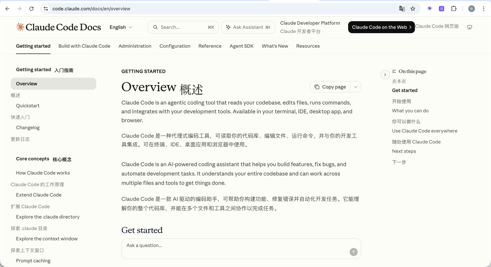
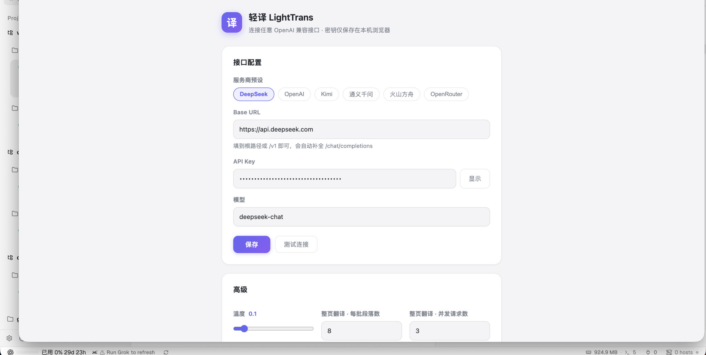
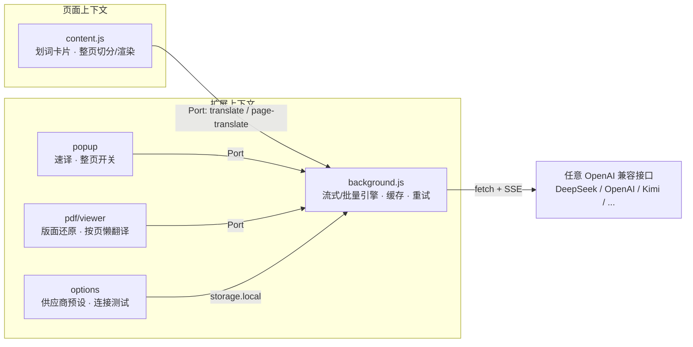

<div align="center">


# 轻译 LightTrans

**为重度英文阅读者打造的浏览器翻译引擎**

划词即译 · 整页双语对照 · PDF 论文精读

[](./LICENSE)
[](https://developer.chrome.com/docs/extensions/develop/migrate/what-is-mv3)
[](#技术设计)
[](#快速开始)

</div>

---

**LightTrans 不是又一个翻译插件的套壳。** 它面向一个明确的场景：以中文为母语的开发者与研究者，每天需要消化大量英文网页、技术文档与学术论文。所有翻译请求直连你自己配置的 OpenAI 兼容接口（DeepSeek / OpenAI / Kimi / 通义千问 / 火山方舟 / OpenRouter / 私有网关），没有中间服务器、没有遥测、没有订阅。

- **零第三方依赖、零构建**：纯原生 JavaScript，核心代码千余行，克隆即用。要把 API Key 交给一个扩展之前，你可以在十分钟内审计完它的全部源码
- **速度即体验**：SSE 流式首字即显、批量请求合并、多路并发、本地译文缓存命中零延迟
- **为论文调校过的 PDF 引擎**：在真实双栏期刊论文上逐页校准的版面还原启发式，而非玩具级的按行提取

## 界面预览

**划词翻译** —— 选中即出发译按钮，流式输出，可拖动卡片，Shadow DOM 样式隔离：



**整页双语对照** —— 译文逐段插入原文下方，自动继承原文排版（字体/字号/颜色/对齐）：



**设置中心** —— 服务商预设一键切换，连接延迟实测，密钥仅存本机：



## 功能矩阵

| 能力 | 说明 | 关键技术 |
|------|------|---------|
| 划词翻译 | 网页任意选区即时翻译，右键菜单亦可触发 | SSE 流式渲染 · closed Shadow DOM |
| 整页双语 | 一键全页对照，再点移除；自动判别页面语言方向 | 叶子块切分 · JSON 映射批量协议 · 逐段兜底 |
| PDF 精读 | arXiv 链接 / 本地文件 / 拖拽打开；左侧原版渲染，右侧逐段译文按页对齐 | pdf.js 渲染 · 版面还原管线 · 按页懒翻译 |
| 弹窗速译 | 任意文本粘贴即译，Enter 触发，自动判向 | 与划词共用流式通道 |
| 深色模式 | 全部界面跟随系统 | `prefers-color-scheme` |

## 快速开始

```bash
git clone https://github.com/byyuchun/lightTrans.git
```

1. 打开 `chrome://extensions`，开启右上角「开发者模式」
2. 「加载已解压的扩展程序」→ 选择 `lightTrans` 目录
3. 点击工具栏「译」图标 → 齿轮进入设置：选择服务商预设（或填任意 OpenAI 兼容 Base URL）→ 填入 API Key 与模型名 → 「测试连接」→ 保存

> Base URL 填到根路径或 `/v1` 即可（如 `https://api.deepseek.com`），扩展会自动补全 `/chat/completions`。

## 使用

| 场景 | 操作 |
|------|------|
| 划词翻译 | 选中文本 → 点击浮现的「译」按钮；或右键 →「轻译：翻译所选文本」；`Esc` 关闭 |
| 整页双语 | 工具栏图标 →「翻译此页」；翻译中可随时停止；再点一次移除译文 |
| PDF 翻译 | 工具栏图标 →「PDF 翻译」；正在浏览 PDF 时按钮变为「翻译此 PDF」一键带入 |
| 弹窗速译 | 工具栏图标 → 输入文本 → `Enter`（`Shift+Enter` 换行） |

## 架构

四个运行时上下文，职责单一，API Key 只在 service worker 中出现：



```
manifest.json        MV3 清单
background.js        service worker：唯一持有密钥与发起网络请求的模块
content.js           划词翻译卡片（Shadow DOM）+ 整页切分/双语渲染
popup/               工具栏弹窗
options/             设置中心
pdf/                 PDF 双语阅读器（内置 Mozilla pdf.js，本地打包，不走 CDN）
icons/               图标（gen_icons.py 可再生成）
```

## 技术设计

### 翻译引擎

- **流式通道**：划词/弹窗走 `stream: true`，SSE 逐 token 渲染，首字延迟即模型 TTFT
- **批量协议**：整页/PDF 将多个段落编号后合入单次请求，要求模型返回 `{id: 译文}` JSON 映射，摊薄请求开销；解析失败或缺段时自动降级为逐段重译
- **分批策略**：段数与字符预算双重上限（默认 8 段 / 3500 字符），并发可调（默认 3 路），指数退避重试，429 感知
- **译文缓存**：`FNV-1a(模型 + 目标语言 + 原文)` 为键写入 `storage.local`，容量上限 4000 条按时间戳淘汰；重复内容零请求

### PDF 版面还原管线

在真实双栏期刊论文（AMS《Journal of Climate》17 页全文）上逐页校准：

```
getTextContent 碎片
  → 行聚合（y 容差 + 词距补空格）
  → 栏缝探测        扫描垂直白带，兼容混合版式（首页单栏摘要 + 双栏正文）
                    与左右栏基线错位；孤立证据剔除防页眉误报
  → 阅读顺序还原    宽行做分隔符，左栏 → 右栏
  → 段落合并        首行缩进 / 行距突变 / 字号突变 / 段末短行启发式；
                    行尾连字符还原（transfor- + mation → transformation）
  → 旁注识别        小字号的脚注/图注/版权信息独立成段，不打断正文
  → 跨页缝合        上页末段句子未完时与下页首段合并为同一翻译单元
```

翻译按页懒执行（视口前后 1400px 预取），画布远离视口自动释放，长文档内存可控。

### 隐私与安全

- API Key 仅存 `chrome.storage.local`，仅被 background service worker 读取，从不进入网页上下文
- 请求从浏览器直连你配置的接口，无中转服务器，无遥测，无统计上报
- 译文回填不使用 `innerHTML`：只解析 `<b>/<i>/<strong>/<em>` 白名单标记，杜绝注入
- 划词 UI 使用 closed Shadow DOM，与页面样式互不污染

## 开发

```bash
# 无构建步骤：改完代码后在 chrome://extensions 点击扩展卡片的刷新图标
# content.js 的变更还需刷新目标网页

# 调试入口
# background：扩展卡片上的 "service worker" 链接
# popup：打开弹窗后右键 → 检查
# content：页面 DevTools → Console context 切换到扩展
```

改动 PDF 抽取启发式前，建议先用真实论文验证（参考 `pdf/viewer.js` 头部注释）。

## Roadmap

- [ ] AI 全文摘要与带上下文的论文问答
- [ ] 术语表注入：同篇文档术语翻译一致性
- [ ] 生词本与划词收藏
- [ ] 输入框翻译（写作辅助）
- [ ] 按站点规则（自动翻译 / 黑名单）

## License

[MIT](./LICENSE) · 内置的 [pdf.js](https://github.com/mozilla/pdf.js) 遵循 Apache-2.0
